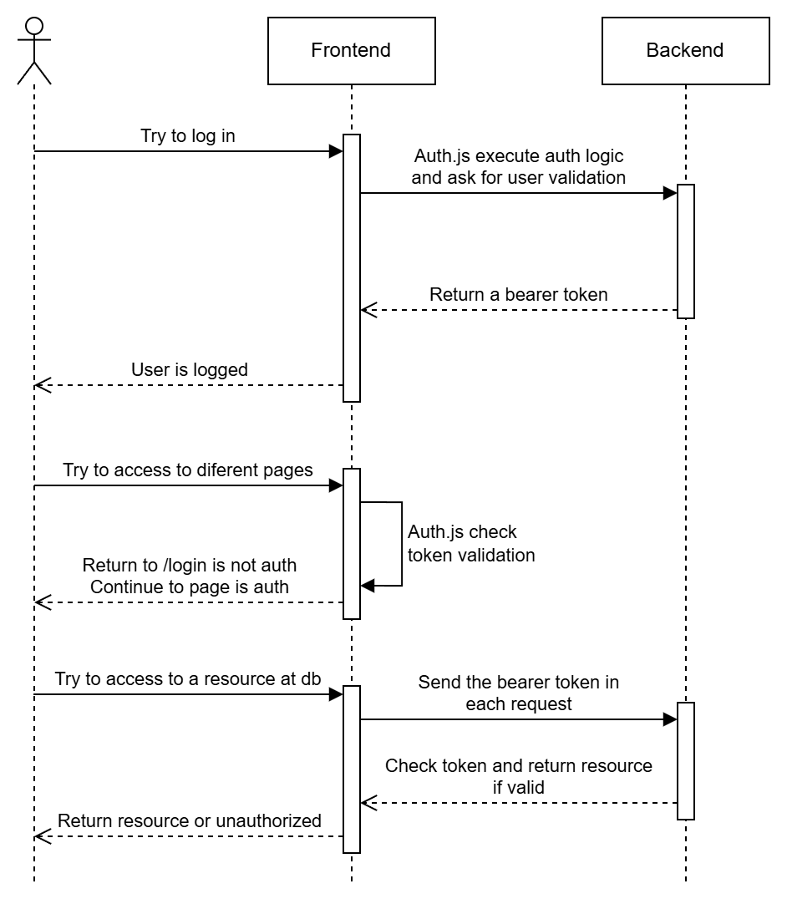

# Utils Feature App

This project includes code examples and explanations about common web development features and practices. It's designed to run locally, serving as a guide to demonstrate how to implement specific functionalities and to answer common questions that may arise during development.

## Features

- Authentication with Auth.js in Next.js and FastAPI using credentials
- Additional common web development features (add more as needed)

## Installation

To run this project locally, follow the steps below:

1. Clone the repository:

   ```bash
   git clone https://github.com/ElPitagoras14/utils-features.git
   ```

2. Install dependencies:

   - For the frontend (Next.js):

     ```bash
     cd frontend
     npm install
     ```

   - For the backend (FastAPI):

     ```bash
     cd backend
     pip install -r requirements.txt
     ```

3. Set up environment variables (if applicable) for both frontend and backend.

4. Run the development servers:

   - Frontend:

     ```bash
     npm run dev
     ```

   - Backend:

   ```bash
   python main.py
   ```

## Usage

- Navigate to the frontend at http://localhost:3000 to interact with the app.
- Access the backend at http://localhost:8000 for API routes.

## Purpose

This app is meant for local experimentation. You can use it as a reference to explore various web development techniques and best practices. It is not intended for production use, but for learning and understanding core functionalities.

## Authentication with Auth.js



- Follow the instructions in the Auth.js documentation to set up the essential files and environment variables.
- Auth.js creates cookies to track the session status.
- The strategy to protect each page route in the frontend is through middleware, while each protected route in the backend uses token dependency.
- The following variables must have the same values in both the frontend and backend to ensure proper functionality: `AUTH_SECRET`, `AUTH_ALGORITHM`, and `AUTH_EXPIRE_MINUTES`.

> [!IMPORTANT]
> If you perform a login using a server component and then navigate to a client page, you must manually reload the page to be authenticated (in server components, it works normally). This issue does not occur when using a client-side login component.

### Sign In

1. The login page is located at `/frontend/src/app/login/page.tsx`.
2. Auth.js sends fixed credentials from `/frontend/src/auth.ts` to the backend (you can modify the credentials logic here).
3. The backend validates the user in the login endpoint at `/backend/src/packages/auth/router.py`. It checks the credentials, generates, and returns a bearer token (you can modify the validation logic here).
4. Upon successful authentication, the backend returns a valid response, and the token information is stored in `session.user` within cookies.

### Navigating Through Pages

1. Each time the user navigates to another page, Next.js executes its middleware (`/frontend/src/middleware.ts`) and validates the token based on its expiration. You can change the expiration settings at `/frontend/src/auth.ts` (line 67).
2. If the token is valid, the page is rendered; otherwise, the user is redirected to the `/login` route.

### Resource Access

1. To simplify the process, an Axios interceptor is used, located at `/frontend/src/lib/axios-config.ts`. It intercepts responses, and if a `401` or `Unauthorized` error is returned, it clears the cookies and redirects the user to `/login`.
2. Each time a request is sent, a bearer token must be included in the request headers so that the backend can retrieve the token and validate the user.

## Roadmap

[x] Authentication through Auth.js

[ ] Rate limiting

## Author

- [Jonathan García](https://github.com/ElPitagoras14) - Computer Science Engineer
